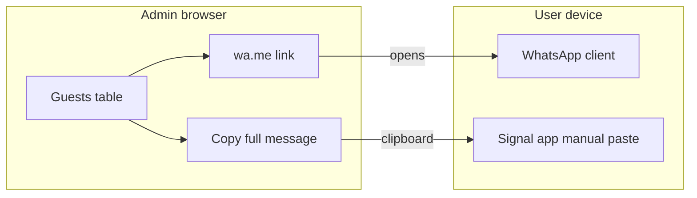

# Feature: WhatsApp and Signal per-guest invites (Level A)

**Scope:** WhatsApp opens via `wa.me` with prefilled text when a phone number is set; Signal uses **copy-paste** of the full invite message (no server send, no `signal-cli`). No Meta Cloud API.

**Implementation todos**

- Add optional E.164 `phone_e164` on guests + admin edit/list validation
- Add `wa.me` link + configurable invite message template (`site_config`)
- Add “Copy message for Signal” (full body + URL), same copy pattern as the invite link button

---

## Current baseline

- Guests: [`models/guest.go`](../models/guest.go), [`migrations/001_create_guests.sql`](../migrations/001_create_guests.sql) — `name`, `code` (spell), optional `email`, no phone yet.
- Admin invite link: `{{BaseURL}}/?spell={{.Code}}` in [`templates/admin/guests.html`](../templates/admin/guests.html); [`handlers/admin.go`](../handlers/admin.go) passes `BaseURL`.

Payload = invite URL, optionally wrapped in text from `site_config` with placeholders `{name}`, `{url}`.

---

## Level A (in scope)

**WhatsApp:** `https://wa.me/<E164_WITHOUT_PLUS>?text=<urlencoded>`. Optional **`phone_e164`** per guest. Admin row: WhatsApp link when phone present.

**Signal:** No stable compose-with-body URL like WhatsApp. **UX:** “Copy message” copies full invite text; user opens Signal, picks chat, pastes.

**Privacy:** Phone numbers are sensitive; rely on existing admin-only access.

---

## Out of scope

- WhatsApp Business Cloud API / Twilio
- `signal-cli` or other automation

---

## Implementation checklist

1. **Migration:** `phone_e164 TEXT NULL` on `guests`; validate/normalize E.164 in Go on save.
2. **Model + store:** extend [`models/guest.go`](../models/guest.go); wire [`handlers/admin.go`](../handlers/admin.go) create/update.
3. **Admin guest edit:** [`templates/admin/guest_edit.html`](../templates/admin/guest_edit.html) — phone field + E.164 hint.
4. **`site_config`:** e.g. `invite_message_de` / `invite_message_en` with `{name}` and `{url}`; resolve in `GuestList` or helper.
5. **Admin guests table:** [`templates/admin/guests.html`](../templates/admin/guests.html)
   - WhatsApp: `<a href="https://wa.me/...">` from phone + encoded message.
   - Signal: `data-copy` with full message (escape for attribute + existing JS).

Guest-facing RSVP unchanged unless you later collect phone there.

---

## Architecture

This file is the repo copy of the feature plan; implement when ready.
